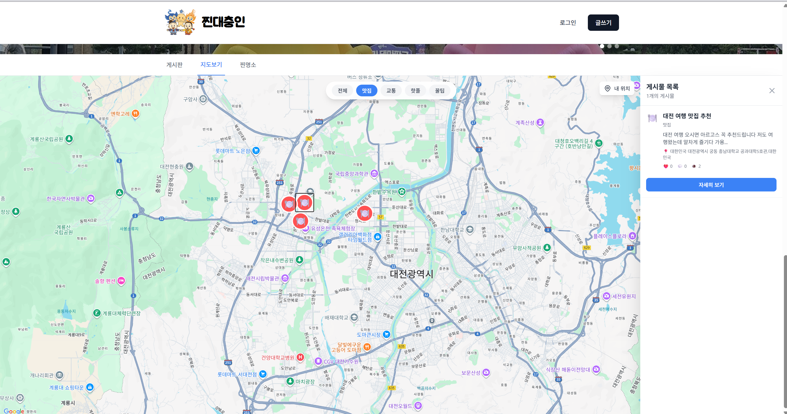
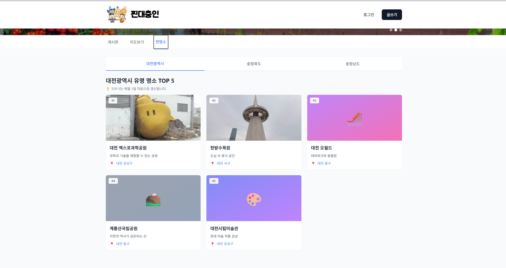
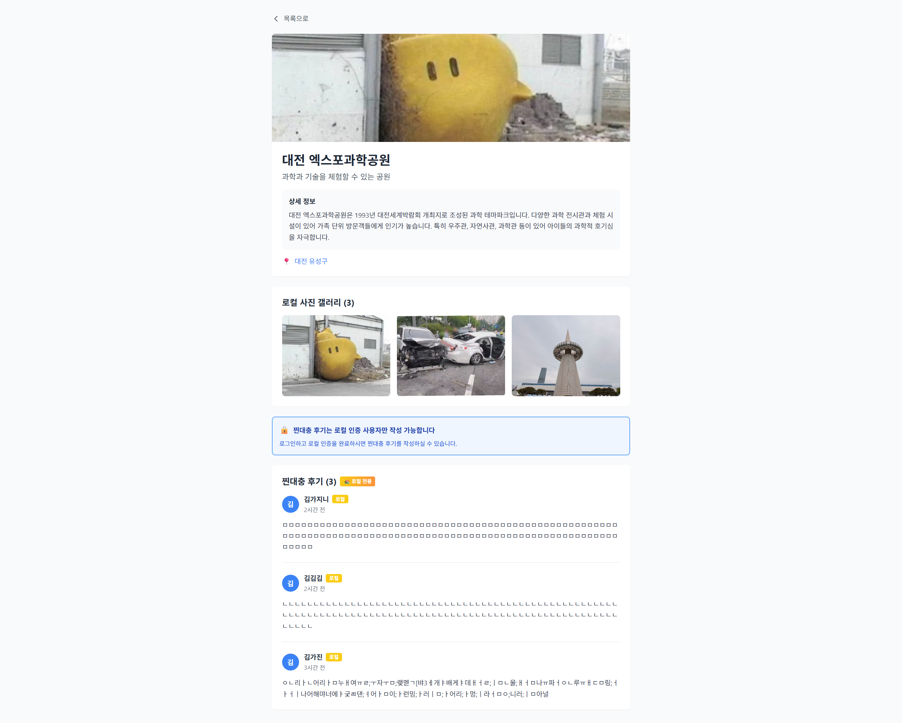
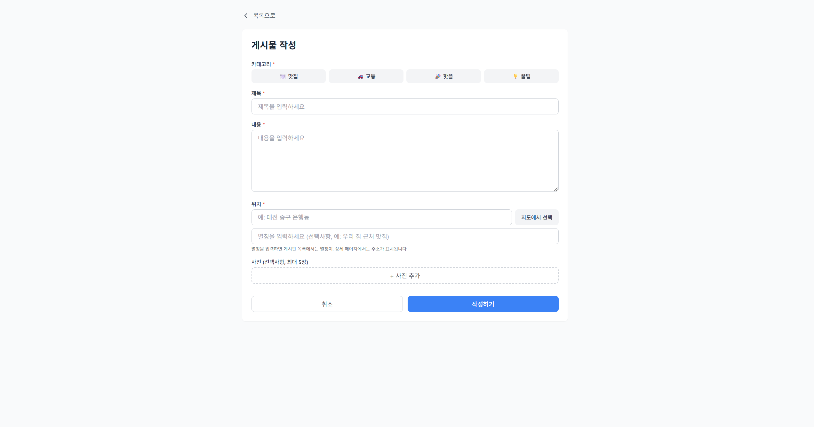
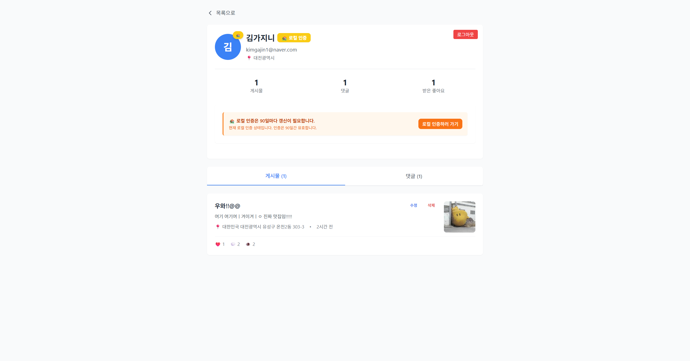
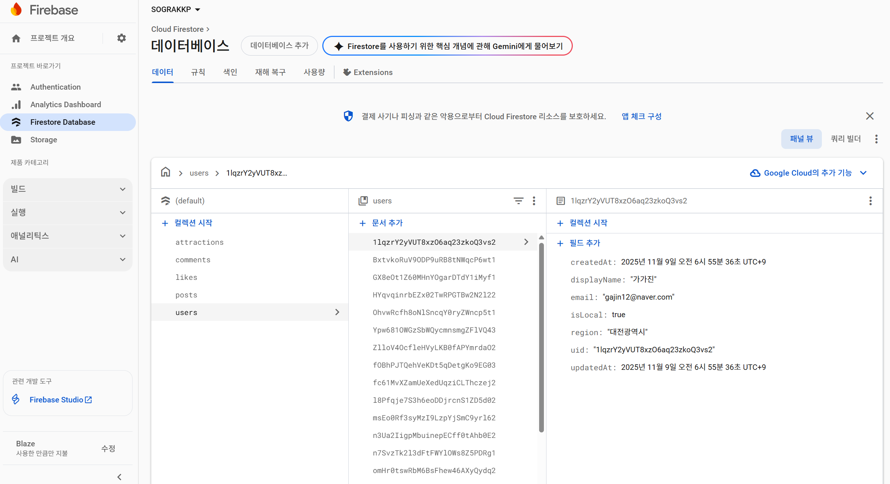
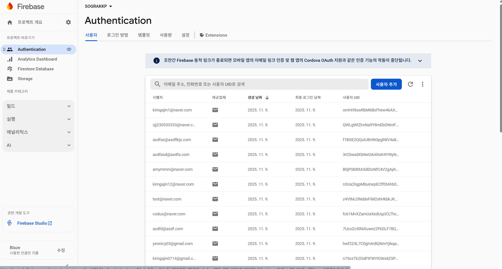

# 🏡 찐대충인 (진짜 대전충청인)

> **"진짜 대전·충청 사람들의 로컬 커뮤니티"**  

> 광고성 후기와 외지인 글 속에서,  

> 지역민이 직접 검증한 **신뢰 가능한 정보**를 제공합니다.

---

## 🎥 데모 영상

[▶ YouTube 데모 보기](https://youtu.be/aLesB7Ejvug)

> 실제 서비스 시연 영상에서는 로컬 인증, 지도 시각화, 게시물 작성, 찐명소 기능을 모두 확인할 수 있습니다.

### 📸 데모 스크린샷

<div align="center">

#### 메인 페이지 & 게시판


*메인 보드*


*지도 보드*

#### 지도 기능


*지도 뷰*


*지도 뷰 예시*

#### 찐명소


*찐명소 목록*


*찐명소 상세*

#### 게시물 & 프로필


*게시물 상세*


*프로필 페이지*

#### Firebase 설정


*Firebase 설정 1*


*Firebase 설정 2*

</div>

---

## 🌍 프로젝트 개요

`찐대충인`은 **대전·충청 지역 로컬 인증 기반 커뮤니티 서비스**입니다.  

기존 커뮤니티의 문제점인 **광고성 글, 비지역민 후기, 낮은 정보 신뢰도**를 해결하기 위해  

GPS 기반 **로컬 인증(Local Verification)** 기능을 통해  

**진짜 지역민들의 생생한 정보**만을 모으는 것을 목표로 합니다.

---

## 🚀 주요 기능

| 기능 | 설명 |
|------|------|
| 🏡 **로컬 인증(Local Verification)** | GPS 기반으로 대전·충청 지역 사용자에게만 '로컬 뱃지'를 부여합니다. |
| 🗺️ **지도 시각화(Map Visualization)** | 게시글의 위치를 Google Maps 위에 표시하여 직관적인 정보 탐색이 가능합니다. |
| 💬 **커뮤니티(Community Board)** | 맛집, 교통, 핫플, 꿀팁 등 주제별 게시판에서 후기 공유 |
| 🎯 **찐명소(Regional Spot)** | 지역민이 직접 올린 명소 후기와 사진 (대전, 충청북도, 충청남도 각 5개씩) |
| 👤 **프로필/로컬 인증 관리** | 로컬 인증 상태 확인 및 90일 갱신 가능 |
| ✍️ **게시글 작성(Write Page)** | 지도 기반 위치 선택 + 이미지 업로드 |
| ❤️ **좋아요·댓글 기능** | 게시물별 좋아요, 댓글, 조회수 집계 |
| 📧 **이메일 인증** | 회원가입 시 이메일 인증 필수 (보안 강화) |

---

## 🧭 서비스 구조

```
[메인페이지]
├── Hot Issue Banner (인기글)
├── Region News Banner (지역 뉴스)
└── TabNavigation
    ├── 게시판(BoardPage)
    │   ├── 카테고리 필터(CategoryFilter)
    │   └── 게시글 카드(PostCard)
    ├── 지도(MapPage)
    │   └── MapView (Google Maps API)
    └── 찐명소(DaejeonChungcheongPage)
        └── AttractionDetailPage
```

---

## ⚙️ 기술 스택

| 구분 | 기술 |
|------|------|
| **Frontend** | React 18.2.0 (Vite 5.0.8), Tailwind CSS 3.3.6, Framer Motion 12.23.24 |
| **Map API** | Google Maps API (`@react-google-maps/api` 2.19.3) |
| **Backend / DB** | Firebase Firestore, Firebase Auth, Firebase Storage |
| **State Management** | React Context API (AuthContext) |
| **Routing** | React Router DOM 6.20.0 (클라이언트 사이드 라우팅) |

---

## 🛡️ 보안 기능 (Security Features)

이 프로젝트는 **보안에 중점을 둔 해커톤**에서 개발되었으며, 다양한 공격으로부터 서비스를 보호하기 위한 여러 보안 기능을 구현했습니다.

| 보안 기능 | 방어 대상 | 구현 방법 |
|----------|---------|---------|
| **XSS 공격 방지** | Cross-Site Scripting | `sanitizeInput()` 함수로 HTML 태그(`<>`), `javascript:`, `on*=` 이벤트 핸들러, `data:` URI 제거. React 기본 이스케이프 + 추가 검증. CSP 헤더 설정. |
| **파일 업로드 공격 방지** | 악성 파일 업로드 | 파일 크기 제한(게시물 5MB, 프로필 2MB), MIME 타입 검증(이미지만), 확장자 화이트리스트(jpg, jpeg, png, gif, webp), 안전한 파일명 생성(사용자ID_타임스탬프.확장자). |
| **경로 탐색 공격 방지** | Path Traversal | 파일명에서 `..`, `/`, `\` 제거, 특수문자 제거, 파일명 길이 제한(255자). |
| **봇 공격 방지 (Honeypot)** | 자동화 봇 | 사용자에게 보이지 않는 숨겨진 입력 필드 사용. 봇이 자동으로 입력하면 요청 차단. |
| **입력 길이 제한** | 스팸 및 버퍼 오버플로우 | 제목: 2-100자, 내용: 10-1000자, 댓글: 최대 500자. Firestore 규칙에서 서버 측 검증. |
| **브루트 포스 공격 방지** | 무차별 대입 공격 | 로그인 실패 5회 시 계정 잠금. 지수 백오프 적용(60초 → 120초 → 240초...). sessionStorage로 시도 횟수 추적. |
| **API 키 숨김** | API 키 노출 | 모든 API 키를 `.env` 환경 변수로 관리. 하드코딩 제거. `.gitignore`에 `.env` 포함. |
| **Firestore 보안 규칙** | 데이터베이스 접근 제어 | 사용자별 읽기/쓰기 권한 제어. 필드 타입 검증, 길이 제한, 작성자 검증. 카테고리 화이트리스트. |
| **Storage 보안 규칙** | 파일 업로드 제어 | 인증된 사용자만 업로드 가능. 파일 크기 및 타입 제한. 본인 파일만 수정/삭제 가능. |
| **이메일 인증 시스템** | 스팸 계정 생성 | 회원가입 시 이메일 인증 필수. 인증 완료 전까지 로그인 불가. Firebase Auth의 `sendEmailVerification` 사용. |

### 보안 구현 상세

#### 1. XSS (Cross-Site Scripting) 방지
- **클라이언트 측 필터링**: `sanitizeInput()` 함수로 모든 사용자 입력값 검증
- **CSP 헤더**: `index.html`에 Content Security Policy 설정
- **React 기본 이스케이프**: React가 자동으로 HTML 이스케이프 처리 + 추가 검증

#### 2. 파일 업로드 보안
- **다층 검증**: 클라이언트(WritePage.jsx) + 서버(Storage Rules) 양쪽에서 검증
- **안전한 파일명**: `{userId}_{timestamp}.{extension}` 형식으로 자동 생성
- **경로 탐색 방지**: 파일명에서 모든 경로 조작 문자 제거

#### 3. 브루트 포스 공격 방지
- **시도 횟수 제한**: 5회 실패 시 계정 잠금
- **지수 백오프**: 실패 횟수에 따라 잠금 시간 증가 (60초 → 120초 → 240초...)
- **sessionStorage 추적**: 브라우저 세션 내에서 시도 횟수 관리

#### 4. Firestore 보안 규칙
- **타입 검증**: 모든 필드의 데이터 타입 검증 (string, number, bool, timestamp 등)
- **길이 제한**: 문자열 필드의 최소/최대 길이 검증
- **작성자 검증**: 본인이 작성한 게시물/댓글만 수정/삭제 가능
- **카테고리 화이트리스트**: 허용된 카테고리만 사용 가능

#### 5. 이메일 인증
- **회원가입 필수**: 이메일 인증 완료 전까지 로그인 불가
- **데이터 보존**: 회원가입 시 입력한 정보는 localStorage에 임시 저장 후 인증 완료 시 Firestore에 복구

---

## 🔐 로컬 인증 방식

- **GPS 기반 위치 확인**: `navigator.geolocation.getCurrentPosition`을 통해 사용자 위치를 확인
- **지역 범위 검증**: 위도·경도 기준 **대전·충청 지역(35.8~37.2N, 126.5~128.3E)** 내일 때 `isLocal = true` 업데이트
- **Firestore 저장**: `users` 컬렉션에 인증 상태 저장
- **인증 유효기간**: 인증은 **90일마다 갱신 필요**
- **로컬 전용 기능**: 로컬 인증된 사용자만 찐명소 후기 작성 및 사진 업로드 가능

---

## 📧 이메일 인증 시스템

- **회원가입 시 필수**: 이메일 인증 완료 전까지 로그인 불가
- **인증 링크 전송**: Firebase Auth의 `sendEmailVerification` 사용
- **데이터 보존**: 회원가입 시 입력한 지역 정보와 로컬 인증 상태는 localStorage에 임시 저장 후 이메일 인증 완료 시 Firestore에 복구
- **보안 강화**: 이메일 인증을 통한 계정 보안 강화

---

## 📁 폴더 구조

```
src/
├── components/
│   └── common/          # Header, TabNavigation, Banner 등
│       ├── Header.jsx
│       ├── HotIssueBanner.jsx
│       ├── RegionNewsBanner.jsx
│       └── TabNavigation.jsx
├── pages/
│   ├── auth/            # 로그인 / 회원가입
│   │   ├── AuthPage.jsx
│   │   └── components/
│   │       ├── LoginForm.jsx
│   │       └── SignupForm.jsx
│   ├── board/           # 게시판
│   │   ├── BoardPage.jsx
│   │   └── components/
│   │       ├── BoardView.jsx
│   │       ├── CategoryFilter.jsx
│   │       └── PostCard.jsx
│   ├── map/             # 지도
│   │   ├── MapPage.jsx
│   │   └── components/
│   │       └── MapView.jsx
│   ├── spot/            # 찐명소
│   │   ├── DaejeonChungcheongPage.jsx
│   │   └── AttractionDetailPage.jsx
│   ├── user/            # 프로필
│   │   └── UserProfilePage.jsx
│   ├── write/           # 게시물 작성
│   │   └── WritePage.jsx
│   └── post/            # 게시물 상세
│       └── PostDetailPage.jsx
├── contexts/            # Context API
│   └── AuthContext.jsx
├── firebase/            # Firebase 설정
│   └── config.js
├── App.jsx              # 전체 라우팅 및 페이지 전환
└── main.jsx             # React 앱 진입점
```

---

## 🪄 실행 방법

### 1. 저장소 클론

```bash
git clone https://github.com/dohyeon321/Sograhackathon.git
cd Sograhackathon
```

### 2. 의존성 설치

```bash
npm install
```

### 3. 환경 변수 설정

`.env.example` 파일을 참고하여 `.env` 파일을 생성하고 다음 환경 변수를 설정하세요:

```env
# Firebase 설정
VITE_FIREBASE_API_KEY=your-firebase-api-key
VITE_FIREBASE_AUTH_DOMAIN=your-project.firebaseapp.com
VITE_FIREBASE_PROJECT_ID=your-project-id
VITE_FIREBASE_STORAGE_BUCKET=your-project.firebasestorage.app
VITE_FIREBASE_MESSAGING_SENDER_ID=your-messaging-sender-id
VITE_FIREBASE_APP_ID=your-app-id
VITE_FIREBASE_MEASUREMENT_ID=your-measurement-id

# Google Maps API 키
VITE_GOOGLE_MAPS_API_KEY=your-google-maps-api-key
```

> **보안 주의**: `.env` 파일은 Git에 커밋하지 마세요. (이미 `.gitignore`에 포함됨)

### 4. 개발 서버 실행

```bash
npm run dev
```

---


## 💡 핵심 포인트

1. **로컬 인증을 통한 신뢰 확보** – 진짜 대전·충청 지역민만 후기 작성 가능
2. **지도 시각화로 직관적 탐색** – 게시글 위치를 지도에 바로 표시
3. **Firebase 기반 서버리스 구조** – 간결한 배포와 확장성
4. **광고 없는 로컬 중심 커뮤니티** – 사용자 경험 중심 설계
5. **이메일 인증 기반 보안** – 계정 보안 강화

---

## 🎯 찐명소 기능

- **지역별 명소**: 대전, 충청북도, 충청남도 각 5개씩 Top 5 명소 표시
- **랜덤 표지 사진**: 업로드된 사진 중 랜덤으로 표지 사진 선택 (페이지 새로고침 시 변경)
- **로컬 전용 후기**: 로컬 인증된 사용자만 찐명소 후기 작성 가능
- **사진 업로드**: 로컬 인증 사용자가 직접 찍은 명소 사진 업로드 가능
- **월간 갱신**: Top 5 명소는 한 달마다 갱신

---

**구미라면축제만관부 made**

